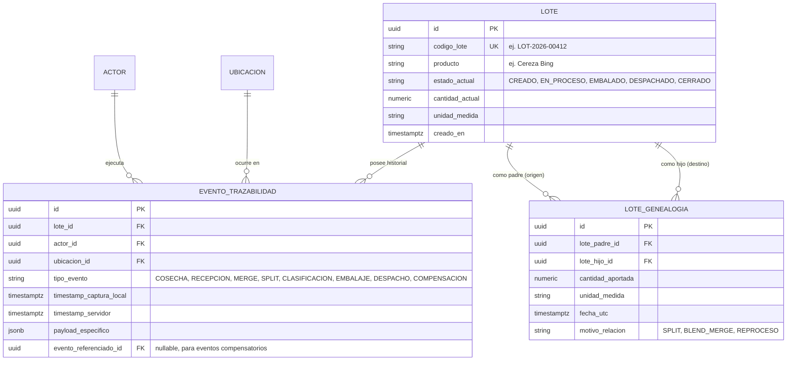

# Domain Rules: Trazabilidad en Agrul

> **Cuándo usar esta skill:** Al modelar entidades centrales, escribir lógica de negocio de lotes y eventos, gestionar el ciclo de vida del producto, linaje N:M (splits/merges) o sincronización offline.

---

## 1. Contexto & Propósito
Agrul es un sistema de trazabilidad de grado agroindustrial y alimentario. Su propósito es proveer una cadena de custodia inalterable desde el origen primario (finca, cuartel, lote de siembra) hasta el consumidor final, soportando operaciones de empaque, fraccionamiento (split) y mezclas (merge) tanto online como con terminales desconectadas en campo.

---

## 2. Invariantes y Reglas No Negociables
1. **Inmutabilidad Absoluta del Log de Eventos:** Los registros en `TraceEvent` representan hechos históricos. **Jamás se editan (`UPDATE`) ni se eliminan (`DELETE`)**.
2. **Correcciones mediante Compensación:** Los errores de pesaje, clasificación o asignación se corrigen mediante un nuevo evento compensatorio (`ANULACION` o `CORRECCION`) que referencia al evento original (`evento_referenciado_id`) y deja asentado el motivo.
3. **Grafo de Linaje N:M Completo:**
   - **División (Split - 1:N):** Un lote padre se fracciona en múltiples lotes hijos (ej: lote de cosecha de 10.000 kg se clasifica en 3 lotes por calibre/calidad).
   - **Fusión (Merge - N:1):** Múltiples lotes padres aportan materia prima a un único lote hijo (ej: uvas de 3 parcelas distintas que van al mismo tanque de fermentación).
   - **Transformación Compleja (N:M):** Combinación de lotes que da origen a múltiples presentaciones finales.
4. **Trazabilidad Bidireccional Recursiva:**
   - **Aguas Arriba (Trace-back):** Reconstrucción completa del grafo de ancestros hasta la semilla/origen.
   - **Aguas Abajo (Trace-forward):** Detección inmediata de todos los descendientes ante recalls sanitarios.
5. **Captura Offline con Timestamps Duales:**
   - Todo evento capturado en campo registra `timestamp_captura_local` (reloj del dispositivo operario) y `timestamp_servidor` (ingesta en Agrul).
   - Si la diferencia supera la ventana permitida (ej: > 7 días), el evento ingresa con flag de auditoría `PENDIENTE_AUDITORIA_OFFLINE`.

---

## 3. Modelo Conceptual de Entidades y Grafo N:M



---

## 4. DOs and DON'Ts

### DO
- **DO:** Al hacer un **Split**, verificar que la suma de las cantidades asignadas a los lotes hijos no supere la cantidad disponible del lote padre.
- **DO:** Al hacer un **Merge**, registrar un evento de tipo `FUSION_ORIGEN` en cada lote padre y un evento `FUSION_RECEPCION` en el lote hijo, linkeados mediante `LoteGenealogia`.
- **DO:** Validar que los actores tengan roles activos y permisos para el tipo de evento en la ubicación especificada.

### DON'T
- **DON'T:** Nunca usar soft-delete (`deleted_at`) en `eventos_trazabilidad`.
- **DON'T:** Nunca permitir ciclos en el grafo de genealogía (un lote no puede ser ancestro de sí mismo).
- **DON'T:** Nunca sobreescribir el `timestamp_captura_local` del operario con el reloj del servidor.

---

## 5. Patrones de Código Canónicos

### ✅ Golden Pattern: División de Lote (Split 1:N) Atómico
```typescript
// core/domain/services/lote-split.service.ts
export async function splitLote(
  lotePadre: Lote,
  especificacionesHijos: Array<{ codigo: string; cantidad: number }>,
  actorId: string,
  ubicacionId: string
): Promise<{ hijos: Lote[]; eventoSplit: TraceEvent; genealogias: LoteGenealogia[] }> {
  const sumaHijos = especificacionesHijos.reduce((sum, h) => sum + h.cantidad, 0);
  
  if (sumaHijos > lotePadre.cantidadActual) {
    throw new CantidadInsuficienteError(lotePadre.codigoLote, lotePadre.cantidadActual, sumaHijos);
  }

  // Generar hijos, descontar stock al padre y crear relaciones
  const hijos = especificacionesHijos.map(h => Lote.crearDerivado(h.codigo, lotePadre.producto, h.cantidad));
  lotePadre.descontarCantidad(sumaHijos);

  // Todo esto será persistido atómicamente en una sola transacción
  return { hijos, lotePadre, ... };
}
```

---

## 6. Registro de Decisiones (Self-Correction Log)
- *2026-10-03:* Se oficializa soporte de genealogía N:M (Splits, Merges, Blends) desde la versión inicial.
- *2026-10-03:* Se adoptan timestamps duales (`timestamp_captura_local` y `timestamp_servidor`) para soporte offline confiable.
