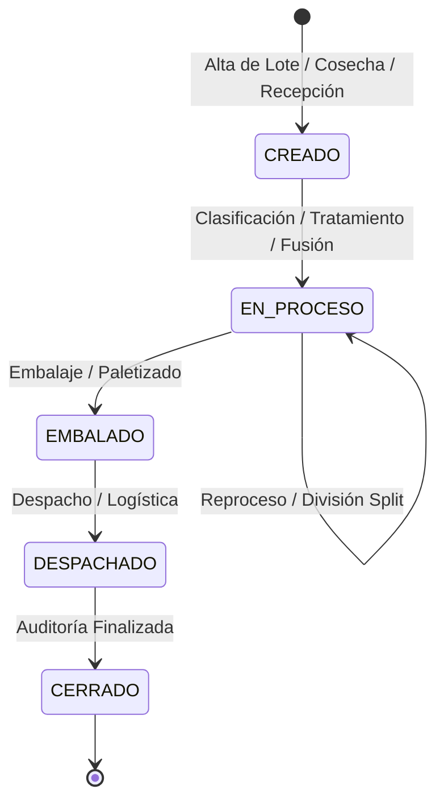

# 📑 Agrul — Especificación Técnica Formal (SPEC)
**Versión:** 1.0.0  
**Fecha:** 2026-10-03  
**Estado:** Aprobado / Implementado (Fase 1 - Core & API Surface)  
**Metodología:** Spec-Driven Development & Matt Pocock Modular Skills  

---

## 1. Visión y Alcance del Producto

**Agrul** es un motor integral de trazabilidad agroindustrial y de cadena de suministro de grado de certificación internacional (GlobalG.A.P., SENASA, USDA Organic). Su propósito fundamental es registrar y auditar cada evento físico o químico que afecta a un producto agrícola desde la siembra o cosecha hasta el embalaje, distribución y consumidor final.

### Objetivos Clave de Ingeniería
- **Cadena de Custodia Inalterable:** Registro histórico append-only con inmutabilidad blindada por base de datos.
- **Soporte de Linaje N:M Completo:** Fraccionamientos (splits), mezclas (merges) y transformaciones con garantía de conservación de masa.
- **Operación Offline en Campo:** Captura con reloj de dispositivo de operario y absorción por lotes resiliente a caídas de conectividad.
- **Arquitectura Modular JIT:** Guías operativas atómicas por dominio gestionadas por un orquestador liviano.

---

## 2. Metodología: Arquitectura de Skills Modulares

El proyecto se rige por un archivo orquestador central y un catálogo de skills atómicas consultadas bajo demanda por asistentes de IA y desarrolladores:

| Componente | Archivo | Responsabilidad |
| :--- | :--- | :--- |
| **Orquestador** | [.cursorrules](file:///c:/AGRUL/.cursorrules) / [AGENT.md](file:///c:/AGRUL/AGENT.md) | Router JIT, reglas de oro de auto-corrección y flujo de trabajo *Plan-First*. |
| **Dominio** | [.cursor/skills/domain-traceability.md](file:///c:/AGRUL/.cursor/skills/domain-traceability.md) | Modelo conceptual de Lote, TraceEvent, Linaje N:M y compensaciones. |
| **Base de Datos** | [.cursor/skills/database-events.md](file:///c:/AGRUL/.cursor/skills/database-events.md) | Dual Model, esquema Drizzle ORM, índices y triggers anti-UPDATE/DELETE. |
| **Arquitectura** | [.cursor/skills/architecture.md](file:///c:/AGRUL/.cursor/skills/architecture.md) | Clean Architecture pragmática, puertos y adaptadores, árbol de carpetas. |
| **Contratos API** | [.cursor/skills/api-contracts.md](file:///c:/AGRUL/.cursor/skills/api-contracts.md) | Envelope `{ success, data, error, timestamp }`, schemas Zod y códigos HTTP. |
| **Testing** | [.cursor/skills/testing-quality.md](file:///c:/AGRUL/.cursor/skills/testing-quality.md) | Vitest, pruebas de inmutabilidad, reglas de mocking y balances de masa. |
| **Plantilla** | [.cursor/skills/TEMPLATE.md](file:///c:/AGRUL/.cursor/skills/TEMPLATE.md) | Estándar para incorporar nuevas skills al sistema. |

---

## 3. Modelo de Dominio y Reglas Invariantes



### Invariantes No Negociables
1. **Inmutabilidad Absoluta del Log de Eventos:** Ninguna fila de la tabla `eventos_trazabilidad` puede modificarse (`UPDATE`) ni eliminarse (`DELETE`).
2. **Corrección mediante Compensación:** Los errores se subsanan con un contra-evento (`COMPENSACION_AJUSTE` o `COMPENSACION_ANULACION`) que enlaza obligatoriamente al evento original mediante `eventoReferenciadoId`.
3. **Conservación de Masa en Splits:** En una división de lote, la suma de las cantidades asignadas a los lotes hijos jamás puede superar la cantidad disponible del lote padre.
4. **Grafo Acíclico Dirigido (DAG):** Ningún lote puede figurar como su propio ancestro en la tabla de genealogía.
5. **Timestamps Duales para Operación Offline:**
   - `timestampCapturaLocal`: Reloj del dispositivo del operario (fijado en el momento real del suceso en campo).
   - `timestampServidor`: Reloj UTC asignado por Agrul al momento de la ingesta HTTP.

---

## 4. Stack Tecnológico Oficial

| Capa | Tecnología | Justificación |
| :--- | :--- | :--- |
| **Runtime & Lenguaje** | Node.js (ESM) + TypeScript 5.7+ | Tipado estricto extremo y ecosistema nativo. |
| **Framework HTTP** | Fastify v5 | Alto rendimiento, overhead mínimo y compatibilidad directa con Zod. |
| **Validación & DTOs** | Zod 3.24+ (`fastify-type-provider-zod`) | Tipado inferido de extremo a extremo sin duplicar interfaces. |
| **Base de Datos** | PostgreSQL 15+ | Soporte nativo `TIMESTAMPTZ`, campos `JSONB` indexados y triggers PL/pgSQL. |
| **ORM & Migraciones** | Drizzle ORM + Drizzle Kit | SQL tipado, cero overhead de abstractions pesadas y migraciones seguras. |
| **Test Runner** | Vitest 3.0+ | Ejecución en memoria ultrarrápida compatible con módulos ESM nativos. |

---

## 5. Esquema de Datos y Persistencia

### Modelo Dual (Read Model + Event Log Append-Only)

```mermaid
erDiagram
    LOTES ||--o{ EVENTOS_TRAZABILIDAD : "posee (1:N)"
    LOTES ||--o{ LOTE_GENEALOGIA : "como padre (origen)"
    LOTES ||--o{ LOTE_GENEALOGIA : "como hijo (derivado)"

    LOTES {
        uuid id PK
        varchar(60) codigo_lote UK "ej. LOT-2026-00412"
        varchar(120) producto
        varchar(100) variedad
        varchar(30) estado_actual "CREADO, EN_PROCESO, EMBALADO, DESPACHADO, CERRADO"
        numeric(14,4) cantidad_actual
        varchar(20) unidad_medida
        timestamptz creado_en
        timestamptz actualizado_en
    }

    EVENTOS_TRAZABILIDAD {
        uuid id PK
        uuid lote_id FK
        uuid actor_id
        uuid ubicacion_id
        varchar(50) tipo_evento "COSECHA, PROCESO, EMBALAJE, etc."
        timestamptz timestamp_captura_local
        timestamptz timestamp_servidor
        jsonb payload_especifico
        uuid evento_referenciado_id FK "nullable"
        varchar(30) estado_sincronizacion "SINCRONIZADO, PENDIENTE_AUDITORIA_OFFLINE"
    }

    LOTE_GENEALOGIA {
        uuid id PK
        uuid lote_padre_id FK
        uuid lote_hijo_id FK
        numeric(14,4) cantidad_aportada
        varchar(20) unidad_medida
        varchar(50) motivo_relacion "SPLIT, BLEND_MERGE, REPROCESO"
        timestamptz fecha_utc
    }
```

### Salvaguarda de Inmutabilidad en PostgreSQL
```sql
CREATE OR REPLACE FUNCTION rechazar_mutacion_evento_trazabilidad()
RETURNS TRIGGER AS $$
BEGIN
    RAISE EXCEPTION 'VIOLACION_DE_INMUTABILIDAD: Los eventos de trazabilidad en Agrul son legalmente inmutables y no admiten UPDATE ni DELETE.';
END;
$$ LANGUAGE plpgsql;

CREATE TRIGGER trg_bloquear_mutacion_eventos
BEFORE UPDATE OR DELETE ON eventos_trazabilidad
FOR EACH ROW EXECUTE FUNCTION rechazar_mutacion_evento_trazabilidad();
```

---

## 6. Contratos de API REST (Fastify v5)

### Envoltorio Estándar de Respuesta (Envelope Pattern)
```json
{
  "success": true,
  "data": { ... },
  "error": null,
  "timestamp": "2026-10-03T22:30:00.000Z"
}
```

### Envoltorio de Error
```json
{
  "success": false,
  "data": null,
  "error": {
    "code": "VALIDATION_ERROR | ENTITY_NOT_FOUND | DUPLICATE_BATCH_CODE | INVALID_STATE_TRANSITION",
    "message": "Descripción clara del motivo",
    "details": [ { "field": "campo", "message": "error específico" } ]
  },
  "timestamp": "2026-10-03T22:30:00.000Z"
}
```

### Catálogo de Endpoints (v1)

| Método | Ruta | Status Éxito | Descripción |
| :--- | :--- | :--- | :--- |
| `GET` | `/api/v1/health` | `200 OK` | Chequeo de estado y conectividad del servicio. |
| `POST` | `/api/v1/lotes` | `201 Created` | Alta de lote con código validado o generado algorítmicamente. |
| `GET` | `/api/v1/lotes/:id` | `200 OK` | Ficha técnica completa del lote con stock y estado actual. |
| `POST` | `/api/v1/lotes/:id/eventos` | `201 Created` | Registro atómico de evento + transición de estado (ACID). |
| `GET` | `/api/v1/lotes/:id/eventos` | `200 OK` | Bitácora histórica completa y cronológica de eventos. |
| `GET` | `/api/v1/lotes/:id/linaje` | `200 OK` | Reconstrucción recursiva de ancestros (*trace-back*) y descendientes (*trace-forward*). |
| `POST` | `/api/v1/eventos/sincronizar` | `200 OK` | **Batch Sync Offline:** Ingesta masiva (hasta 500 items) de eventos de campo. |

---

## 7. Mapeo de Códigos de Error HTTP

| Código | Significado | Disparador en Agrul |
| :--- | :--- | :--- |
| `200 OK` | Operación exitosa | Consultas y batch sync completados. |
| `201 Created` | Recurso creado | Alta de lotes y registro de eventos. |
| `400 Bad Request` | Fallo sintáctico | Violación de schemas Zod (campos faltantes, formato de fecha o UUID inválido). |
| `404 Not Found` | No encontrado | `Lote` o `TraceEvent` inexistente en la base de datos. |
| `409 Conflict` | Conflicto de datos | `CodigoLote` ya registrado por otro lote. |
| `422 Unprocessable` | Regla de negocio rota | Violación de máquina de estados (ej: evento sobre lote cerrado) o stock insuficiente. |
| `500 Server Error` | Fallo de infraestructura | Errores no controlados; oculta trazas internas en producción. |

---

## 8. Estado Actual de la Suite de Calidad

- **Runner:** Vitest v3
- **Total de pruebas automatizadas:** 31 tests activos
- **Tasa de éxito:** 100% de tests pasando en < 5 segundos
- **Categorías cubiertas:**
  1. *Unitarios de Dominio:* `CodigoLote`, `MaquinaEstadosLote`, `TraceEvent` y `LoteGenealogia`.
  2. *Unitarios de Aplicación:* `CrearLoteUseCase`, `RegistrarEventoUseCase` y `ObtenerLinajeUseCase`.
  3. *Integración HTTP Fastify:* Healthcheck, validación Zod, errores semánticos, avance de estados y batch offline.
- **Chequeo de Tipos:** `tsc --noEmit` con 0 errores bajo configuración estricta.

---

## 9. Próximas Fases en el Roadmap

- **Fase 2:** Casos de uso de división formal (`DividirLoteUseCase`) y mezcla (`FusionarLotesUseCase`) con sus endpoints dedicados.
- **Fase 3:** Generación de migraciones PostgreSQL con Drizzle Kit y script de inicialización de triggers PL/pgSQL en contenedor Docker.
- **Fase 4:** Interfaz Web Dashboard (React/Vite o Next.js) con visualizador interactivo de grafos de linaje (árbol genealógico) y lector de código QR para operarios de campo.
